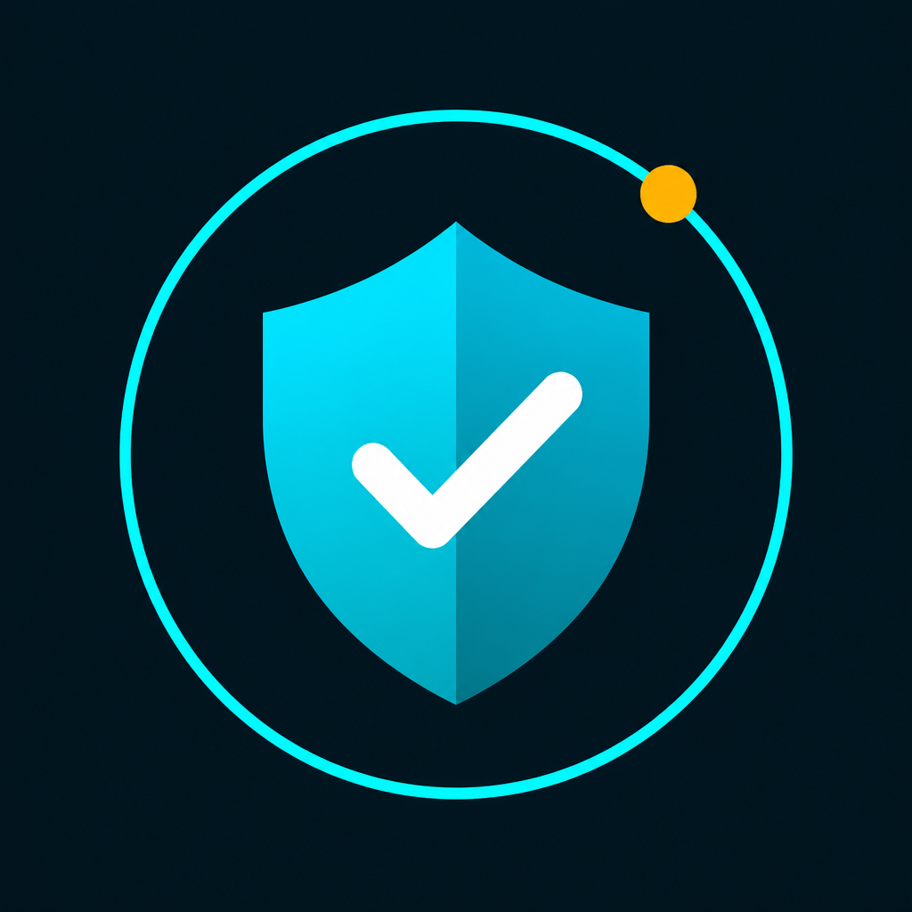

# Real Time Security

AI-powered real-time security dashboard with face recognition, object detection, and automatic email alerts.



## Features

- Live camera monitoring in a modern web dashboard
- Face recognition (authorized vs unauthorized)
- YOLOv8 object detection
- Emotion analysis
- Automatic email alerts with unauthorized person snapshots
- Dual recipient email support
- Local alert image saving (`alerts/`)
- Auto video recording on alerts (`recordings/`)
- Left navigation UI with Real Time Security branding

## Tech Stack

- Python + Flask
- OpenCV
- face_recognition
- DeepFace
- YOLOv8 (Ultralytics)
- Gmail SMTP (App Password)

## Setup

1. Clone the repo:

```bash
git clone https://github.com/k-v-jaswanth/Real-Time-AI-Security-System.git
cd Real-Time-AI-Security-System
```

2. Install dependencies:

```bash
pip install -r requirements.txt
```

3. Create `.env` from the example:

```bash
copy .env.example .env
```

Set:

```env
SECURITY_EMAIL=realtimesecuritysystem@gmail.com
SECURITY_EMAIL_PASSWORD=your-16-char-app-password
SECURITY_ALERT_RECIPIENT=first@gmail.com
SECURITY_ALERT_RECIPIENT_2=second@gmail.com
```

4. Add authorized faces:

```text
data/authorized_faces/
  person_name/
    photo1.jpg
    photo2.jpg
```

5. Run:

```bash
python main.py
```

Open: [http://127.0.0.1:5000](http://127.0.0.1:5000)

## Email Alerts

When an unauthorized person is detected:

1. Snapshot is saved in `alerts/`
2. Same image is emailed to both configured recipients
3. Optional short video is saved in `recordings/`

Use a Gmail **App Password** (not your normal password):  
https://myaccount.google.com/apppasswords

## Live Public Link (optional, laptop must stay on)

Keep the app running, then in another terminal:

```powershell
powershell -ExecutionPolicy Bypass -File .\start_live.ps1
```

This creates a temporary public URL. It **stops** if the laptop sleeps or shuts down.

## Always Online Website (no laptop needed)

See [DEPLOY_WEBSITE.md](DEPLOY_WEBSITE.md) to host the dashboard on Render.
This keeps the website online even when your laptop is off (camera still needs local PC).

## Always Online with Camera (cloud + IP camera)

See [DEPLOY.md](DEPLOY.md) for VPS + IP/RTSP camera hosting.

## Project Structure

```text
main.py                 # App entry
app.py                  # Flask routes
security_engine.py      # Camera + AI + email alerts
templates/index.html    # Dashboard UI
static/                 # CSS, JS, logo
alerts/                 # Unauthorized snapshots
recordings/             # Alert videos
.env.example            # Email config template
```

## Notes

- Do not commit `.env` (contains secrets)
- Model weights (`.pt`) and runtime DB/logs are ignored
